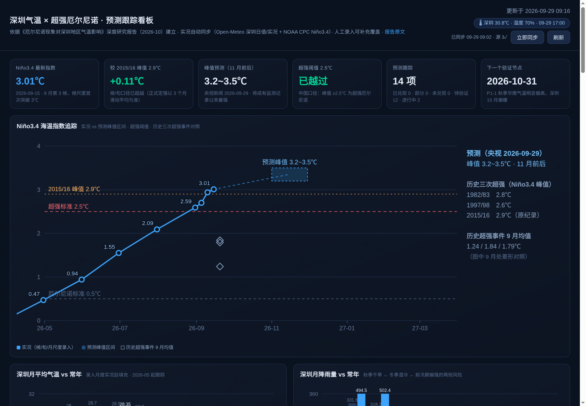

# 深圳气温 × 超强厄尔尼诺 · 预测跟踪看板



依据《厄尔尼诺现象对深圳地区气温影响 — 深度研究报告》（2026-10，原文见 `public/report.md`）搭建的预测跟踪工具：把报告的分期研判拆成 **14 项可验证预测**，自动同步开放数据源 + 人工录入实况，自动判定每项预测的兑现状态，并提供深色主题可视化看板。

**核心特性**

- **预测自动判定**：每项预测带验证窗口 + 判定规则（指标、聚合方式、目标阈值），录入/同步实况后自动给出 待验证 → 进行中·暂符合 → 已兑现/部分兑现/未兑现 的状态流转
- **开放数据源自动同步**（`sync.js`）：Open-Meteo 深圳日值/实况 + NOAA CPC Niño3.4 月指数，每 30 分钟定时拉取，幂等落库，人工录入优先
- **衍生判定自动化**：整月均温/雨量、炎热日/寒冷日事件、24h 降温（寒潮代理）、**入秋/入冬日期**（五天滑动平均首破）均由日值自动推导
- **事件自动检测**：7 类规则检测器从日值中自动生成时间线事件（寒潮/热浪/暴雨/干旱/湿冷/月值偏离/季节转换）
- **大模型研判**（`llm.js`）：接入任意 OpenAI 兼容接口，每日自动 + 手动生成结构化简报（当前形势/预测逐项对照/下阶段关注/风险提示），防幻觉约束写死在 prompt
- **AI 逐项判定**：大模型对 14 项预测逐项给出语义判定（verdict + 置信度 + 引用数据的理由），与规则状态并列展示，可人工复核覆盖
- **响应式看板**：手机端适配（无横向溢出），顶栏向下滚动自动折叠、向上展开
- **零依赖部署**：纯 Node.js 内置模块（≥18，用内置 fetch），无 npm install，数据为 JSON 文件落盘

## 看板板块

| 板块 | 说明 |
|---|---|
| KPI 卡 | Niño3.4 最新指数、距 2015/16 峰值 2.9℃ 的差值、超强阈值 2.5℃ 突破状态、预测兑现统计、下一个验证节点 |
| Niño3.4 追踪图 | 实况折线（候/旬/月尺度）+ 2026-11 预测峰值区间带（3.2~3.5℃）+ 0.5/2.5/2.9 三条阈值线 + 历史三次超强事件对照 |
| 气温/降雨 vs 常年 | 2026-05 起逐月实况与常年值对照柱状图，自动标色（偏暖/接近/偏冷、偏多/偏少），未定月画半透明"本月至今"虚柱 |
| 预测跟踪板 | 14 项预测按「事件强度 / 2026 秋季 / 2026/27 冬季 / 2027 春夏」分组：状态徽章（规则自动判定）+ AI 逐项判定条（verdict/置信度/理由）+ 研判原文 + 当前值 vs 目标 + 验证窗口，支持人工复核覆盖，可一键"AI 判定" |
| AI 研判 | 大模型基于看板数据生成的结构化简报，每日自动 + 手动触发，保留历史版本 |
| 事件时间线 | 披露 / 媒体 / 研判 / 数据检测自动生成，带来源筛选与分页（20 条/页） |
| 数据录入 | 选指标 → 录入日期 + 数值（日期型指标录日期）→ 保存后全页自动重算；观测记录表分页（20 条/页）；两个录入表单并排对齐 |

## 开放数据源自动同步

| 来源 | 内容 | 更新节奏 |
|---|---|---|
| [Open-Meteo](https://open-meteo.com)（开源、免密钥） | 深圳日值（日均温/最高/最低/降雨，ERA5 archive + 分析场双源合并）、深圳当前实况（顶栏实况芯片） | 逐日；看板每 30 分钟拉取一次 |
| [NOAA CPC](https://www.cpc.ncep.noaa.gov/data/indices/)（免密钥） | Niño3.4 月距平指数（1991-2020 基准） | 月度（次月初更新） |

同步机制：

- 服务启动 2.5 秒后首跑，之后**每 30 分钟定时**；页面每 5 分钟自动刷新，也可点顶栏"立即同步"或 `curl -X POST /api/sync`
- 月值**整月齐备才落库**；未整月在图表上画半透明"本月至今"虚柱，不参与判定
- 幂等落库：自动记录 id 固定为 `auto-<指标>-<日期>`；**同指标同日期有人工录入时人工优先**（官方口径与再分析格点有差异，以你录入的为准）
- 同步状态在顶栏（悬停看各源明细/错误），落在 `data/sync.json`
- ⚠️ 日值来自再分析/分析场格点，与深圳国家站实测有 ±0.5℃ 级差异；判定敏感的项请以深圳市气象局实况人工录入复核
- 网络不通时顶栏显示 ✗ 与错误详情，人工录入不受影响

## 事件自动检测（数据驱动）

`sync.js` 每轮同步后在日值序列上跑 7 类规则检测器，事件自动写入时间线（`auto:true`，幂等 id `auto-evt-<类型>-<日期>`，时间线可按来源筛选）：

| 检测器 | 触发规则 | 关联预测 |
|---|---|---|
| 寒潮过程 | 24h 日均温降幅 ≥8℃ 预警 / ≥10℃ 强寒潮 | P2-2 |
| 高温热浪 | 连续 ≥3 天日最高 ≥33℃ | P3-1 |
| 暴雨/大暴雨 | 日雨量 ≥50 / ≥100mm | P3-3 |
| 干旱少雨段 | 连续 ≥20 天有效降水 <1mm | P1-2 |
| 湿冷时段 | 连续 ≥3 天日均温 ≤12℃ 且湿度 ≥80% | P2-4 |
| 月值显著偏离 | 月均温偏离 ≥1.0℃；月雨量偏离 ≥50% | 各期 |
| 季节转换 | 入秋/入冬自动判定成功时 | P1-3 / P2-5 |

阈值以代码常量形式写在 `sync.js` 的 `detectEvents` 中，可按需调整。

## 大模型研判（AI 简报）

1. 复制 `data/config.example.json` 为 `data/config.json`，填入 OpenAI 兼容接口的 `baseUrl / apiKey / model`（智谱 GLM、DeepSeek、OpenAI、本地 vLLM 等均可），`config.json` 已被 `.gitignore` 排除，不会把 key 推上仓库
2. 刷新页面，「AI 研判」面板出现**生成简报**按钮；配置有效时服务端还会**每日自动生成一次**（每 10 分钟检查当天是否已生成）
3. 简报固定四节：当前形势 / 预测逐项对照（覆盖全部 14 项）/ 下阶段关注点 / 风险提示；markdown 渲染，保留最近 30 次历史

防幻觉约束（写在 `llm.js` 的 prompt 中）：输入只喂看板结构化状态快照，要求所有结论引用具体数值、禁止引入输入之外的事实、数据不足须明说。产出仍标注 **AI 生成，仅供研究参考**。

### AI 逐项判定

- **触发**：预测跟踪板右上"AI 判定"按钮单独触发；生成简报（手动/每日自动）时也会顺带更新
- **产出**：每项预测一条判定 `{verdict, confidence, reason}`，写回 `predictions.json` 的 `aiJudge` 字段；卡片上以紫色"AI 判定"条展示，与规则状态并列
- **口径**：窗口进行中禁止给出终局判定（verified/missed），只能给 active_ok / active；判定不得与预测自带阈值分档矛盾
- **定位**：AI 判定是语义层参考（会引用数值解释"为什么"），不覆盖规则状态与人工复核

## 运行

```bash
node server.js
# → http://localhost:3000（可用 PORT=xxxx 覆盖端口）
```

## 状态判定规则

每项预测带 `verify`（指标 + 聚合方式 max/min/sum/avg/latest + 目标阈值）和验证窗口：

- 窗口未开始 → **待验证**
- 窗口进行中，条件已满足 → **进行中·暂符合**；未满足 → **进行中**
- 窗口结束后条件满足 → **已兑现**；未满足 → **未兑现**；落入中间档 → **部分兑现**（如峰值 2.9~3.2℃ 之间：超强成立但未达预测区间）
- 日期型指标（入秋/入冬）支持"晚于基准日期**或未发生**视为兑现"（对应"入冬更难"的表述）
- 任何状态可人工复核覆盖（判定口径有歧义、官方口径与代理指标不一致时使用）

## 项目结构

```
sz-weather/
├── server.js            # 零依赖 HTTP 服务：静态页面 + JSON API + 判定引擎
├── sync.js              # 开放数据源自动同步 + 事件检测器
├── llm.js               # 大模型研判（OpenAI 兼容接口直连）
├── data/                # 数据层（JSON 落盘，全部可手工修正）
│   ├── metrics.json     # 指标注册表（名称、单位、类型、录入口径）
│   ├── normals.json     # 常年值基准（近似值，可按官方值修正）
│   ├── predictions.json # 14 项预测：原文、来源、验证窗口、判定规则、人工复核
│   ├── observations.json# 实况观测（含自动同步记录与历史背景对照）
│   ├── events.json      # 事件时间线（人工 + 数据检测自动生成）
│   ├── sync.json        # 最近一次同步状态（运行时生成）
│   ├── analysis.json    # AI 简报历史（运行时生成，保留 30 次）
│   └── config.example.json # LLM 配置模板；复制为 config.json 填 key（该文件不入库）
├── public/              # 前端（原生 HTML/CSS/JS + SVG 图表，无框架）
│   ├── index.html / app.js / style.css
│   └── report.md        # 报告原文副本（看板内可查看）
└── docs/screenshot.png  # 看板截图
```

## 数据文件说明

| 文件 | 内容 |
|---|---|
| `metrics.json` | 指标注册表（名称、单位、类型、录入口径说明） |
| `normals.json` | 常年值基准（月均温/月雨量/入秋入冬日期/冬季雨量等）。**为按公开资料整理的近似值，如与深圳市气象局官方值有出入，直接改此文件** |
| `predictions.json` | 14 项预测：原文、来源、验证窗口、判定规则、人工复核记录 |
| `observations.json` | 实况观测（已预置报告中可核实的数据；带 `background:true` 的为历史/背景对照，不参与判定；带 `auto:true` 的为自动同步记录） |
| `events.json` | 事件时间线 |

## API

```bash
# 读取全量状态（含判定结果与同步状态）
curl http://localhost:3000/api/state

# 触发一次同步
curl -X POST http://localhost:3000/api/sync

# 生成一次 AI 研判简报（需已配置 data/config.json）
curl -X POST http://localhost:3000/api/analysis

# 仅更新 14 项预测的 AI 逐项判定
curl -X POST http://localhost:3000/api/ai/judge

# 录入观测（例：10 月 Niño3.4 月均指数）
curl -X POST http://localhost:3000/api/observations \
  -H 'Content-Type: application/json' \
  -d '{"metric":"nino34_ssta","date":"2026-10-31","value":3.15,"source":"国家气候中心月报","note":"10月平均"}'

# 录入日期型指标（例：入秋日期）
curl -X POST http://localhost:3000/api/observations \
  -H 'Content-Type: application/json' \
  -d '{"metric":"sz_enter_autumn","date":"2026-11-15","value":"2026-11-15","source":"深圳市气象局"}'

# 人工复核某项预测
curl -X POST http://localhost:3000/api/predictions/P2-1/status \
  -H 'Content-Type: application/json' \
  -d '{"status":"partial","reason":"官方口径与代理指标不一致"}'

# 添加事件 / 删除误录观测（自动记录删除后会在下轮同步恢复）
curl -X POST http://localhost:3000/api/events -H 'Content-Type: application/json' \
  -d '{"date":"2026-12-18","level":"披露","title":"强寒潮过程最低气温 4.2℃","source":"深圳市气象局"}'
curl -X DELETE http://localhost:3000/api/observations/<记录id>
```

## 预测清单（14 项）

| ID | 阶段 | 摘要 | 判定 |
|---|---|---|---|
| P0-1 | 事件强度 | 峰值 3.2~3.5℃、史上最强 | 分级：≥3.5 / 3.2~3.5 兑现；≥2.9、≥2.5 部分兑现 |
| P0-2 | 事件强度 | 超强级别确认 | 窗口内指数 ≥2.5℃ |
| P1-1 | 2026 秋季 | 10 月明显偏暖 | 月均温 ≥25.7℃（常年约 25.2 + 0.5） |
| P1-2 | 2026 秋季 | 11 月少雨干燥 | 月雨量 ≤35mm |
| P1-3 | 2026 秋季 | 入秋推迟 | 入秋晚于 11-08 或未入秋 |
| P2-1 | 2026/27 冬季 | 暖冬基准 | 冬季三月均温均值 ≥16.8℃（常年约 16.5 + 0.3） |
| P2-2 | 2026/27 冬季 | 冷暖过山车 | 出现 24h 降温 ≥10℃ |
| P2-3 | 2026/27 冬季 | 极端寒潮情景 | 最低温分级 ≤3 / ≤5 / ≤10℃ |
| P2-4 | 2026/27 冬季 | 湿冷、降水偏多 | 冬季累计雨量 ≥130mm（常年约 108 + 20%） |
| P2-5 | 2026/27 冬季 | 入冬偏晚/未入冬 | 入冬晚于 01-21 或未入冬 |
| P2-6 | 2026/27 冬季 | 寒冷日 ≥1 天 | 寒冷日累计 ≥1（常年 0.8 天） |
| P3-1 | 2027 春夏 | 高温热浪更显著 | 炎热日累计 ≥60 天（对照 2025 纪录） |
| P3-2 | 2027 春夏 | 龙舟水偏强 | 4-6 月累计雨量 ≥960mm（常年约 800 + 20%） |
| P3-3 | 2027 春夏 | 大暴雨过程 | 出现日雨量 ≥100mm |

> 免责：常年值为近似参考；自动同步日值来自再分析格点，与台站实测有差异，判定以录入实况为代理指标，与官方口径不一致时用人工复核。气候预测存在固有不确定性，重大决策以气象部门滚动发布为准。
